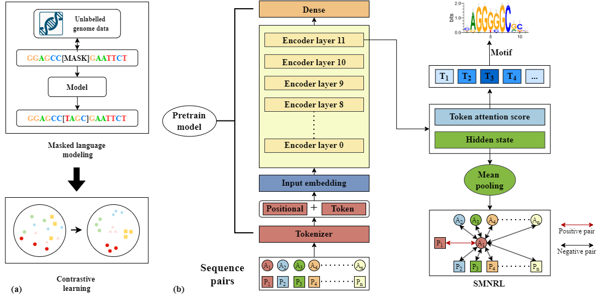

# NyxBind🧬

NyxBind is a high-performance pre-trained model for transcription factor binding site (TFBS) prediction. It is built upon a pretrain genome foundation model with additional contrastive learning to enhance sequence representation for regulatory genomics.

## Model Architecture

<div align="center">
  
  <p><em>NyxBind model architecture showing the contrastive learning framework built on DNABERT-2</em></p>
</div>

---

# Table of Contents

- [NyxBind](#nyxbind)
- [Model Architecture](#model-architecture)
- [1. Environment Setup](#1-environment-setup)
  - [1.1 Create and Activate Virtual Environment](#11-create-and-activate-virtual-environment)
  - [1.2 Install the Package and Dependencies](#12-install-the-package-and-dependencies)
- [2. Download NyxBind (Pretrained, Not Fine-tuned)](#2-download-nyxbind-pretrained-not-fine-tuned)
- [3. Dataset Structure](#3-dataset-structure)
- [4. Fine-tuning on Downstream Tasks](#4-fine-tuning-on-downstream-tasks)
  - [4.1 Full-Parameter Fine-tuning](#41-full-parameter-fine-tuning)
  - [4.2 LoRA Fine-tuning](#42-lora-fine-tuning)
- [5. Motif Visualization and Extraction](#5-motif-visualization-and-extraction)
  - [5.0 Attention Pattern Visualization (NEW)](#50-attention-pattern-visualization-new)
  - [5.1 Extract attention score](#51-extract-attention-score)
  - [5.2 Extracting Motifs](#52-extracting-motifs)
  - [5.3 TomTom Comparison](#53-tomtom-comparison)
  - [5.4 Other Baseline Models for Motif Visualization](#54-other-baseline-models-for-motif-visualization)
- [6. Contrastive Learning](#6-contrastive-learning)
  - [6.1 Data Availability](#61-data-availability)
  - [6.2 Running Contrastive Learning](#62-running-contrastive-learning)
- [7. Benchmark](#7-benchmark)
  - [7.1 Models](#71-models)
  - [7.2 BERT-TFBS & BERT-TFBS_N](#72-bert-tfbs--bert-tfbs_n)
  - [7.3 DeepBind & DanQ](#73-deepbind--danq)
  - [7.4 NT Series](#74-nt-series)
- [Notes](#notes)

## 1. Environment Setup

We recommend setting up a virtual environment using Anaconda.

### 1.1 Create and Activate Virtual Environment

```bash
conda create -n nyxbind python=3.8
conda activate nyxbind
```

### 1.2 Install the Package and Dependencies

```bash
git clone https://github.com/ai4nucleome/NyxBind.git
cd NyxBind
pip install -r requirements.txt
```

---

## 2. Download 
### 2.1 Download NyxBind (Pretrained, Not Fine-tuned)🚀

You can load the pretrained NyxBind model from Hugging Face:

```python
from transformers import AutoTokenizer, AutoModel
from transformers.models.bert.configuration_bert import BertConfig

config = BertConfig.from_pretrained("CompBioDSA/NyxBind")
tokenizer = AutoTokenizer.from_pretrained("CompBioDSA/NyxBind", trust_remote_code=True)
model = AutoModel.from_pretrained("CompBioDSA/NyxBind", trust_remote_code=True, config=config)
```
### 2.2 Download data for contrastive learning
https://drive.google.com/file/d/1lHscT-jg3Y-r68YmgbDUo4v9r6L3lyVR/view?usp=sharing

---

## 3. Dataset Structure📁

To fine-tune NyxBind on downstream TFBS tasks, organize your dataset in the following format:

```
--Folder/
  └── TF_NAME/
      ├── train.csv
      ├── dev.csv
      └── test.csv
```

Each `.csv` file should contain labeled DNA sequences, typically with `sequence` and `label` columns.

---

## 4. Fine-tuning on Downstream Tasks🛠️

NyxBind supports two fine-tuning modes: **full-parameter fine-tuning** and **parameter-efficient LoRA fine-tuning**.

📌📌📌Note:
All settings are configured for a single GPU. If you are using multiple GPUs, you may increase the batch size accordingly.

### 4.1 Full-Parameter Fine-tuning

You can run the full-parameter fine-tuning using the following command, or modify and run `./finetune/ft/ft.sh`:

```bash
python train.py \
    --model_name_or_path $model_path \
    --data_path $data \
    --kmer -1 \
    --run_name FT_${lr}_${folder_name}_${seed} \
    --model_max_length 30 \
    --per_device_train_batch_size 32 \
    --per_device_eval_batch_size 32 \
    --gradient_accumulation_steps 1 \
    --learning_rate ${lr} \
    --num_train_epochs 5 \
    --fp16 \
    --save_steps 200 \
    --output_dir output/NyxBind-FT-${lr} \
    --evaluation_strategy steps \
    --eval_steps 200 \
    --warmup_steps 30 \
    --logging_steps 100000 \
    --overwrite_output_dir True \
    --log_level info \
    --find_unused_parameters False
```

> 🔧 You can modify `model_path` to use DNABERT2 or NyxBind. Feel free to adjust batch size, learning rate, and other hyperparameters.

---

### 4.2 LoRA Fine-tuning

Use LoRA (Low-Rank Adaptation) for efficient fine-tuning:

```bash
python train.py \
    --model_name_or_path $model_path \
    --data_path $data \
    --kmer -1 \
    --run_name LoRA_${lr}_${folder_name}_${seed} \
    --model_max_length 30 \
    --use_lora \
    --lora_r 8 \
    --lora_alpha 16 \
    --lora_target_modules 'query,value,key,dense' \
    --per_device_train_batch_size 32 \
    --per_device_eval_batch_size 32 \
    --gradient_accumulation_steps 1 \
    --learning_rate ${lr} \
    --num_train_epochs 5 \
    --fp16 \
    --save_steps 100 \
    --output_dir output/NyxBind-LoRA${lr} \
    --evaluation_strategy steps \
    --eval_steps 100 \
    --warmup_steps 30 \
    --logging_steps 100000 \
    --overwrite_output_dir True \
    --log_level info \
    --seed ${seed} \
    --find_unused_parameters False
```

> 🧪 LoRA enables training with fewer trainable parameters. You can tune `lora_r`, `lora_alpha`, and target modules as needed.

---

## 5. Motif Visualization and Extraction🔍

This section details the process of visualizing and extracting sequence motifs from attention scores generated by the fine-tuned NyxBind model.

# The `motif` Folder: A Closer Look at its Contents

The `motif` folder serves as the central hub for all operations related to motif visualization, extraction, and benchmarking. Here's a breakdown of its key sub-files and sub-directories:

- **33JASPAR**  
  This sub-directory contains JASPAR data, specifically organized for visualizing 33 predefined motifs. JASPAR is a widely recognized open-access database of curated transcription factor binding profiles.

- **attention_output**  
  You'll find the attention scores generated by the fine-tuned NyxBind model stored here. These scores are crucial for deriving meaningful sequence motifs.

- **attention_visualization/** 
  A new module for visualizing attention patterns as interactive line diagrams. Contains:
  - `extract.py`: Extracts raw attention weights from transformer models
  - `visualize_attention.py`: Creates horizontal line-based attention visualizations
  - `att_viz.sh`: Example script demonstrating attention comparison between base and fine-tuned models

- **find_motifs.py**  
  This Python script is designed to identify and extract motifs from processed data.

- **meme**  
  This sub-directory serves as a storage location for MEME (Multiple Em for Motif Elicitation) outputs, including both newly generated and existing motifs used in analysis.

- **motif_benchmark**  
  This folder contains the necessary data and scripts for benchmarking the motif generation and fine-tuning processes of various models, such as BertSNR, DeepSNR, and D_AEDNet.

- **motif.sh**  
  This bash script automates the process of generating motifs directly from the attention scores and their corresponding sequences. this script run `find_motifs.py` and `motif_utils.py`.

- **motif_utils.py**  
  This Python utility script provides common functions and helper classes that are used across other motif-related scripts, streamlining tasks like data processing or motif manipulation.

- **result**  
  This is the output directory where the final generated motif logos (visual representations of sequence motifs) and PFMs (Position Frequency Matrices) are saved.

- **score_from_sft.py**  
  This Python script is specifically dedicated to extracting attention scores from the model's output.

- **sft.sh**  
  A bash script that manages the entire attention score extraction process, likely executing `score_from_sft.py`.

---

### 5.0 Attention Pattern Visualization

The `attention_visualization` module provides tools to extract and visualize attention patterns from transformer models. This is particularly useful for comparing attention mechanisms between base models (DNABERT-2) and fine-tuned models (NyxBind).

#### Quick Start

Navigate to the attention visualization directory:

```bash
cd motif/attention_visualization
```

#### Step 1: Extract Attention Weights

Extract raw attention weights from a model for a given DNA sequence:

```bash
python extract.py \
    --model_path ../../model/DNABERT-2-117M \
    --sequence "CTGGTGTGCTGTAGCCATGTCTTAGGCAAGTCCCCTTGTGCATGTTCCTTATCTGTGCCTGCAGGCTGTTCTTTTGTTTGAAAGGATTCATCTGAGCACCC" \
    --output_dir ./attention_vis \
    --save_name GATA2-base.npy
```

**Parameters:**
- `--model_path`: Path to the pre-trained model (DNABERT-2 or fine-tuned NyxBind)
- `--sequence`: Input DNA sequence to analyze
- `--output_dir`: Directory to save attention outputs
- `--max_length`: Maximum token length (default: 30)
- `--save_name`: Filename for the saved attention array

#### Step 2: Visualize Attention Patterns

Create interactive line-based visualizations of attention patterns:

```bash
python visualize_attention.py \
    --npy_path ./attention_vis/GATA2-base.npy \
    --model_path ../../model/DNABERT-2-117M \
    --sequence "CTGGTGTGCTGTAGCCATGTCTTAGGCAAGTCCCCTTGTGCATGTTCCTTATCTGTGCCTGCAGGCTGTTCTTTTGTTTGAAAGGATTCATCTGAGCACCC" \
    --save_path ./output/GATA2-base.svg \
    --threshold 0.02
```

**Parameters:**
- `--npy_path`: Path to the saved attention numpy file
- `--model_path`: Path to the model (for tokenizer)
- `--sequence`: Same DNA sequence used in extraction
- `--save_path`: Output file path for the visualization (SVG format)
- `--threshold`: Minimum attention weight to display (default: 0.02)

#### Example: Compare Base vs Fine-tuned Models

Use the provided example script to compare attention patterns:

```bash
bash att_viz.sh
```

This script will:
1. Extract attention from DNABERT-2 (base model)
2. Extract attention from NyxBind (fine-tuned model)
3. Generate side-by-side visualizations for comparison

**Visualization Features:**
- Horizontal line diagrams showing token-to-token attention
- Layer-wise attention display
- Color-coded attention weights (cyan with varying intensity)
- Special highlighting for [CLS] and [SEP] tokens (yellow)
- Black background for better visibility

---

### 5.1 Extract attention score

After obtaining attention scores using `sft.sh`, you can visualize the learned motifs derived from the attention maps.

Ensure the following files are available:
- `./33JASPAR/<TF_NAME>/motif.csv`: original sequence file
- `../finetune/ft/output/NyxBind-33-ft/weights/<TF_NAME>`: ft models

To convert the attention scores into interpretable sequence motifs, run the visualization script:

```bash
python score_from_sft.py \
    --model_path path/to/finetuned_model \
    --data_path path/to/sequence_data \
    --output_root path/to/save_attention_scores \
    --selected_layers 11 \
    --batch_size 256 \
    --max_length 30
```

### 5.2 Extracting Motifs

Ensure the following files are available:
- `./attention_output/NyxBind/<TF_NAME>/atten.npy`: attention score file
- `./33JASPAR/<TF_NAME>/motif.csv`: original sequence file

To further analyze and identify motifs, you can use the `motif.sh` script. An example of its usage is:

```bash
python find_motifs.py \
    --data_dir path/to/sequence_data \
    --predict_dir path/to/attention_score_folder  \
    --window_size 11 \
    --min_len 6 \
    --top_k 1 \
    --pval_cutoff 0.005 \
    --min_n_motif 10 \
    --align_all_ties \
    --save_file_dir path/to/save_folder \
    --verbose
```
The parameter top_k = 1 indicates that we select the most frequently occurring motif as the final representative motif. Although the default window_size is set to 11 for easier comparison, it can be extended up to 24 to potentially improve performance by capturing longer motif patterns.

This script analyzes the specified data and prediction directories to identify motifs based on configurable parameters such as window size, minimum motif length, p-value cutoff, and the minimum number of motifs to extract. The --save_file_dir argument determines the output directory where the discovered motifs will be saved.

### 5.3 TomTom Compariso

#### Preparation

Before running the comparison, you need to convert Position Frequency Matrices (PFMs) into PWM MEME format files using the provided Jupyter notebook:

Ensure the following files are available:
-'../result/NyxBind/<TF_name>/PFMfile.jaspar': PFM file

results will be saved to './motif/meme/NyxBind/<TF_name>.meme'

```bash
.motif/meme/transfer-meme.ipynb
```

#### TOMTOM
Ensure the following files are available:

- `./human/human.meme`: A merged MEME-format file containing all known human TFBS motifs.
- `./motif/meme/NyxBind/<TF_name>.meme`: MEME-format file containing motifs generated by NyxBind for a specific transcription factor.


The script `./motif/meme/tom.sh` is used to compare the generated motifs against all known human TFBS motifs, represented as Position Weight Matrices (PWMs).

#### Results
After run tom.sh
Filered results will be saved in ./motif/meme/filter_res

### 5.4 Other Baseline Models for Motif Visualization

> We gratefully acknowledge the **BertSNR** team for providing their dataset and model architecture, which served as a valuable reference for benchmarking motif visualization performance.

The `motif_benchmark/` directory contains all baseline models, datasets, and scripts used for motif visualization comparison. Below is the structured overview:

```
motif_benchmark/
├── Baseline/ 
│   ├── Weight/                  # Pretrained weights for DeepSNR and D-AEDNet
│   ├── DeepLearning_Motif.py   # Motif generation script for DeepSNR and D-AEDNet
│   ├── DeepLearning_Test.py    # Testing script for DeepSNR and D-AEDNet
│   ├── DeepLearning_Train.py   # Training script for DeepSNR and D-AEDNet
│   ├── Matching_method.py      # Matching baseline method
│   ├── motif.sh                # Shell script to generate motif logos for DeepSNR and D-AEDNet
│   ├── train.sh                # Shell script to train DeepSNR and D-AEDNet
│
├── DNABERT/                    
│   ├── 3-new-12w-0/            # 3-mer pretrained DNABERT model (download separately from Hugging Face)
│   ├── ...                     # Other model variants
│
├── Dataset/               
│   ├── ChIP-seq/               # 33 preprocessed ChIP-seq datasets for finetuning
│   ├── ReMap/                  # 33 datasets for motif visualization
│   ├── CreateDataset.py        # Script to generate dataset files
│   ├── DataLoader.py           # Data loading utilities
│   ├── DataReader.py           # Data reading utilities
│   ├── MyDataSet.py            # Custom dataset class
│
├── Main/              
│   ├── CrossValidToken.py      # Cross-validation script
│   ├── GenerateMotif.py        # Motif generation using BertSNR
│   ├── Predict.py              # TFBS prediction
│   ├── TrainMultitask.py       # Multitask training
│   ├── train.sh                # Train BertSNR model
│   ├── motif.sh                # Generate motifs from BertSNR
│
├── Model/                      # Model architectures
│   ├── BertSNR.py              
│   ├── D_AEDNet.py   
│   ├── DeepSNR.py        
│
└── Utils/               
    ├── BertViz.py              # Attention visualization tool
    ├── Metrics.py              # Evaluation metrics
    ├── MotifDiscovery.py       # Motif discovery methods
    ├── Shuffle.py              # Dinucleotide frequency shuffling
    ├── Visualization.py/       # Additional visualization tools
```

---

#### Data Processing

Use the `Dataset/CreateDataset.py` script to generate k-mer sequence files from the 33 ChIP-seq datasets. These files are used to finetune **BertSNR**, **DeepSNR**, and **D-AEDNet**.

---

#### Training

- Run `Main/train.sh` to train the **BertSNR** model.
- Run `Baseline/train.sh` to train **DeepSNR** and **D-AEDNet**.

---

#### Motif Generation

- Use `Main/motif.sh` to generate motifs using **BertSNR**.
- Use `Baseline/motif.sh` to generate motifs using **DeepSNR** and **D-AEDNet**.

---

####  Note

We provide pretrained weights for **DeepSNR** and **D-AEDNet** in the `Baseline/Weight/` folder.  
However, for **BertSNR**, you must manually download the DNABERT model from Hugging Face and train BertSNR yourself using the provided scripts.


## 6. Contrastive Learning

To begin, download the pretrained **DNABERT-2** model from Hugging Face:  
👉 [https://huggingface.co/zhihan1996/DNABERT-2-117M](https://huggingface.co/zhihan1996/DNABERT-2-117M)

Replace the `bert_layers.py` file in the model directory with the customized version provided by **NyxBind** (also available on Hugging Face).

> We sincerely thank the DNABERT-2 team for offering a powerful genome-specific foundation. Their pretrained model served as a critical starting point for **NyxBind**’s contrastive pretraining.

---

### 6.1 Data Availability📁

Ensure the following data directories exist:

- `../data/contrastivelearningdataset`: Contains sequence pairs from 160 types of TFBS.  
  - Sequences from chromosomes 1–23 (excluding 11 and 12), X, and Y are used as the **training set**.  
  - Mixed sequences from chromosomes 11 and 12 are used as the **validation** and **test sets**.

- `./model/DNABERT-2-117M`: Pretrained DNABERT-2 model with NyxBind-modified `bert_layers.py`.

---

### 6.2 🔧 Running Contrastive Learning

To start training, run the provided script:

```bash
./cl/run.sh
```

This script executes the following command:

```bash
python cl.py \
  --train_batch_size 128 \
  --eval_batch_size 128 \
  --num_epochs 3 \
  --max_seq_length 30 \
  --random_seed 42 \
  --learning_rate 3e-5 \
  --base_path $BASE_PATH \
  --model_name_or_path $BASE_MODEL \
  --start_layer 11\
  --loss SMNRL \
  --model_save_root "output/NyxBind"
```

- `start_layer`: Specifies the starting encoder layer for contrastive learning.  
  For example, if set to `10`, it will extract embeddings from layers 10 and 11 and perform mean pooling for contrastive learning.

## 7. Benchmark

### 7.1 Models

The `evaluation/` directory includes benchmark pipelines for testing the performance of different TFBS prediction models under a unified evaluation framework.

```
evaluation/
├── bert-tfbs/         # BERT-TFBS evaluation scripts
│   ├── CBAM.py        # Convolutional Block Attention Module for enhancing BERT features
│   ├── train.py       # Training script for BERT-TFBS and BERT-TFBS_N
│   └── train.sh       # Shell script to run the training pipeline
│
├── cnn/               # CNN-based baseline models
│   ├── cnn.py         # Simple CNN model for TFBS prediction
│   ├── DanQ.py        # RNN-CNN hybrid model (DanQ architecture)
│   ├── DeepBind.py    # Classic DeepBind model
│   └── cnn.sh         # Shell script to train and evaluate CNN baselines
│
└── nt/                # Evaluation with Nucleotide Transformer models
    ├── train.py       # Training or feature extraction using NT models
    └── nt.sh          # Shell script to evaluate with NT models
```

---

### 7.2 BERT-TFBS & BERT-TFBS_N

To train **BERT-TFBS** or **BERT-TFBS_N**, simply run:

```bash
./evaluation/bert-tfbs/train.sh
```

You can switch between the pretrained models by modifying the `model_path` variable in the script:

```bash
# BERT-TFBS_N: uses NyxBind as the base model
model_path='../../cl/output/NyxBind'

# BERT-TFBS: uses DNABERT2 as the base model
model_path='../../model/DNABERT-2-117M'
```

---

### 7.3 DeepBind & DanQ

We sincerely thank the **DeepSTF** team for providing a PyTorch version of these models on GitHub.

To train **DeepBind** or **DanQ**, execute:

```bash
./evaluation/cnn/cnn.sh
```

You can switch the model being used by modifying the `model_name` variable in the script:

```bash
model_name='DeepBind'  # Options: 'DeepBind' or 'DanQ'
```

---

### 7.4 NT Series

To evaluate the **Nucleotide Transformer** (NT) series, run:

```bash
./evaluation/nt/nt.sh
```

You can specify which NT model to use by passing an index as an argument:

```bash
bash nt.sh 0   # nucleotide-transformer-v2-500m-multi-species
bash nt.sh 1   # nucleotide-transformer-500m-human-ref
bash nt.sh 2   # nucleotide-transformer-2.5b-1000g
bash nt.sh 3   # nucleotide-transformer-2.5b-multi-species
```

Make sure the corresponding pretrained models are downloaded and accessible via the appropriate paths in the script.

---

### 📌 Notes

- All models share a consistent data format for training and evaluation.
- Metrics include ROC-AUC, PR-AUC, accuracy, precision, recall, and F1-score.
- Motif visualization results (if applicable) will be saved in each model’s respective `output/` directory.


